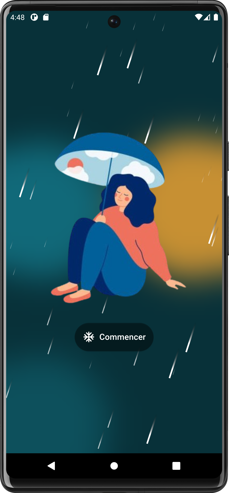
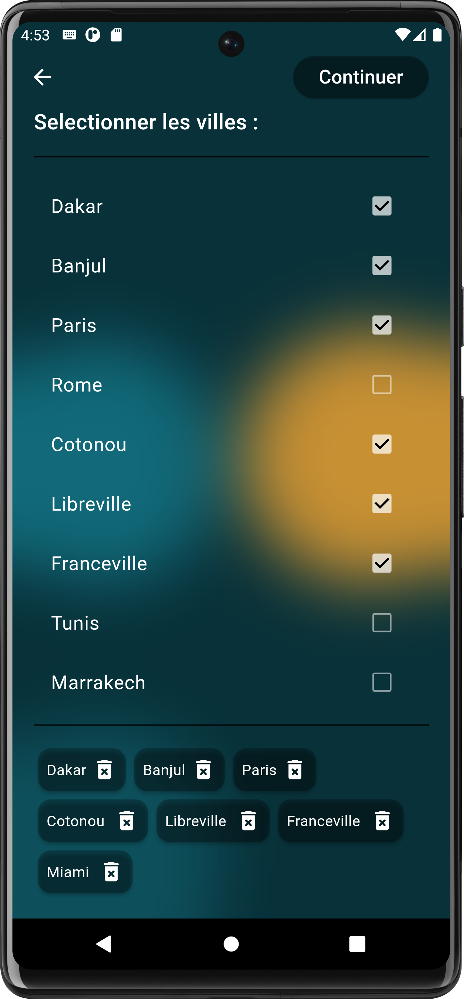
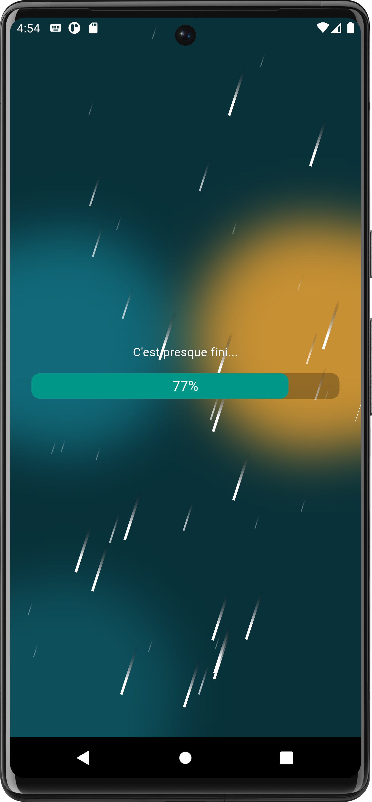
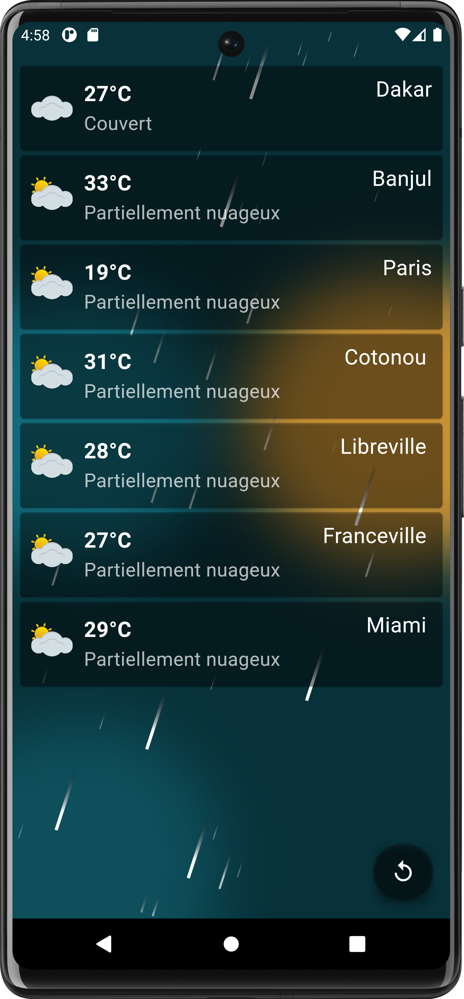
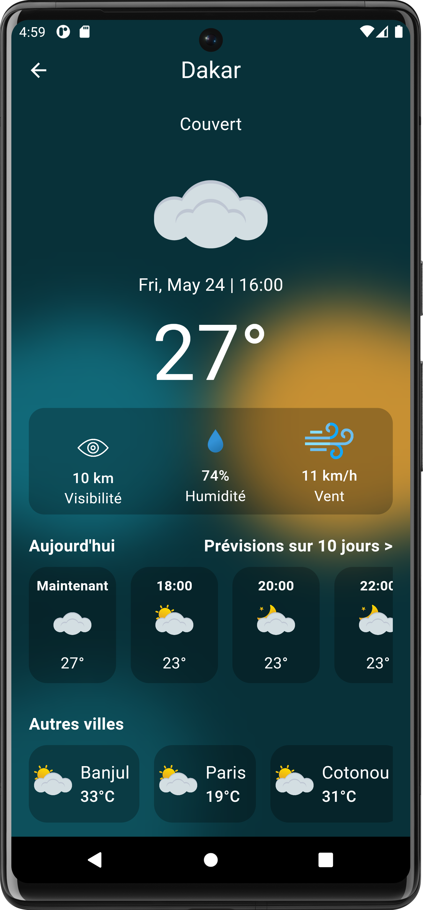
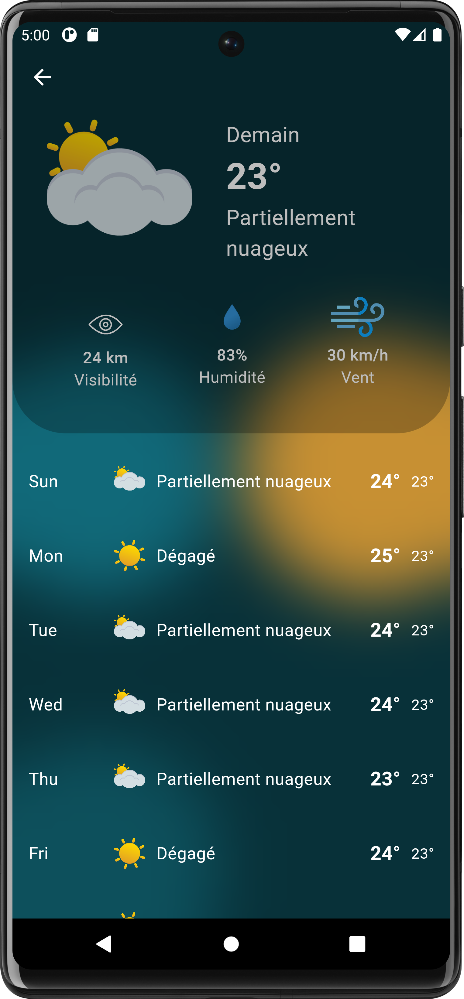

> # Flutter Weather App

C’est une application mobile développée en <a href="https://fr.wikipedia.org/wiki/Flutter_(logiciel)">Flutter</a> (framework du langage de prorammation Dart). Elle permet de visualiser les prévisions météorologiques de certaines villes (cette version de l’application ne prend en compte que des villes prédéfinies). Grace à l’API météo de Visual Crossing, l’application fournit des données précises des conditions actuelles et des prévisions sur plusieurs jours. L’interface de l’application a été pensé de sorte à être intuitive et conviviale.

## Présentation de l'application'

